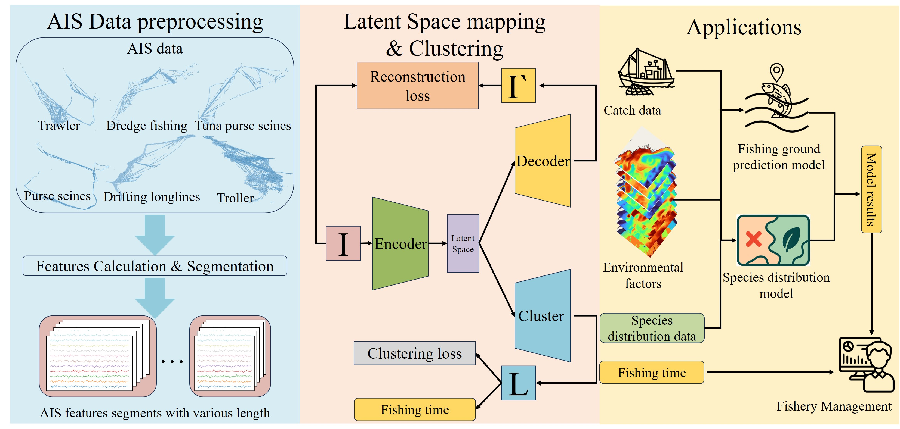

# Applying Deep Unsupervised Learning to Automatic Identification System Data for Fishing Behavior Detection

This repository contains the source code for the paper Applying Deep Unsupervised Learning to Automatic Identification System Data for Fishing Behavior Detection. In this study, we use deep unsupervised learning to identify fishing vessel operational states.

